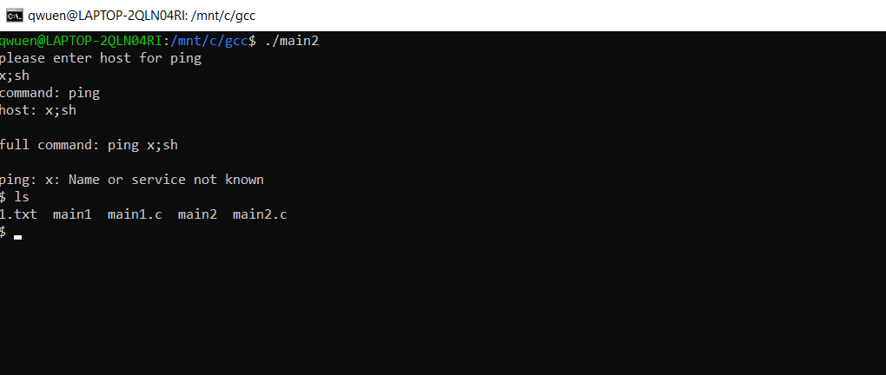

# Домашнее задание к занятию «Язык С и программные уязвимости»

### Результаты

В качестве результата пришлите ответы на следующие вопросы:
1. Какое предупреждение (`Warning`) было выведено при компиляции? По желанию: проведите доп.исследование на предмет сути предупреждения (с чем оно связано, какие риски от использования одной из функций в программе и что это за функция).
 `warning: the 'gets' function is dangerous and should not be used.`

`gets()` - принимает всю строку ввода и вносит данные в массив, и если длина массива будет меньше, чем строка – то эта строка выйдет за пределы массива, в другой, непредсказуемый, участок памяти, что может привести к тому что эта строка перезапишет данные, уже имеющиеся в этом участке памяти.
1. Ввод, приводящий к падению приложения  
*При вводе очень длинной строки:*
 
1. Ввод, приводящий к выполнению другой команды (не `ping`)
* *Выполнение подмены команды путем перезаписи памяти*
`1234567890123456ls /etc`

* Путем выполнения нескольких команд  
*please enter host for ping*  
`x;ls /etc `  

## Задание 2
Проведите повторный анализ и посмотрите:
1. Можно ли реализовать переполнение?  
`Не получилось`
1. Можно ли выполнить произвольную команду (если да, то как)?  
`да`
1. Если ответ на п.2 - да, то можно ли получить shell (т.е. запустить `sh` и `bash` и продолжить работу с интерпретатором команд в интерактивном режиме)?
