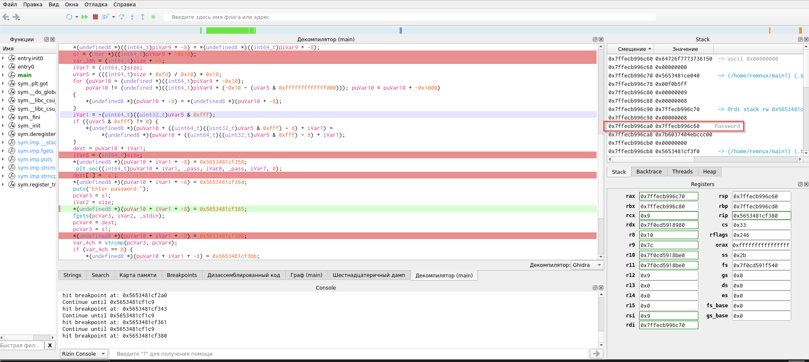
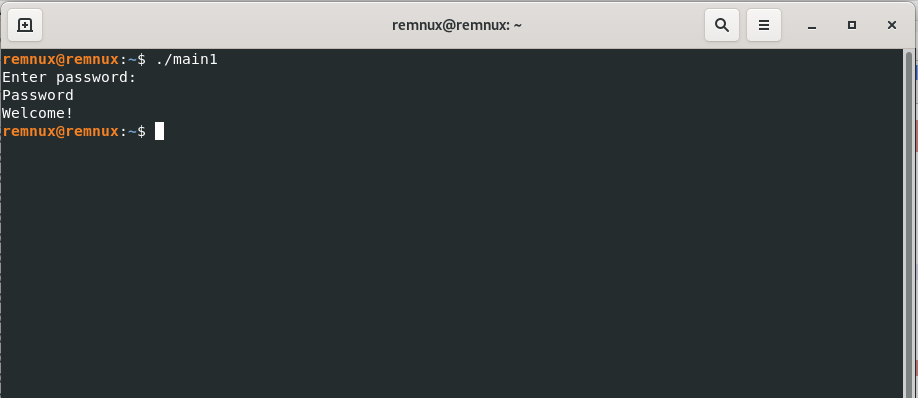

# Домашнее задание к занятию «Реверс-инжиниринг»

### Результаты

## Задание 1

Чем отличается декомпиляция от дизассемблирования?

*Декомпиляция* – это процесс автоматического восстановления программы на языке высокого уровня из программы на языке низкого уровня. По сути попытка получения исходного кода программы.

*Дизассемблирование* – восстановление текста программы на ассемблере из исполняемой программы в машинных кодах. 

## Задание 2* (необязательное)

Найдите пароль, который требует программа [main1](../00_Code/main1).
(При вводе правильного пароля будет вывед текст "Welcome!")

**Пароль - "Password"**

